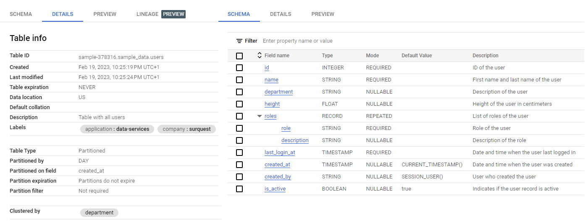

# Introduction

This package is a wrapper around the Google Cloud BigQuery API to simplify management of the BigQuery tables. The specification of the BigQuery tables is realized with the help of YAML file and the package provides the functionality to:

* instantiate BigQuery table based on YAML specification
* create BigQuery based on created instance
* drop BigQuery table
* truncate BigQuery table
* load data into BigQuery table from blob in GCS bucket

## Installation

```bash
pip install surquest-GCP-bq-grid
```

# Getting started

Let's assume that we have a YAML file that specifies BigQuery table as follows:

```yaml
name: users
desc: Table with all users
labels:
  company: surquest
  application: data-services
clustering_fields:
  - department
time_partitioning:
  field: created_at
  type: DAY
schema:
  - name: id
    desc: ID of the user
    mode: required
    type: INTEGER
  - name: name
    desc: First name and last name of the user
    mode: required
  - name: department
    desc: Description of the user
  - name: height
    desc: Height of the user in centimeters
    type: FLOAT
  - name: roles
    desc: List of roles of the user
    type: STRUCT
    mode: repeated
    fields:
      - name: role
        desc: Role of the user
        mode: required
      - name: description
        desc: Description of the role
  - name: last_login_at
    desc: Date and time when the user last logged in
    type: TIMESTAMP
    mode: REQUIRED
  - name: created_at
    desc: Date and time when the user was created
    type: TIMESTAMP
    mode: NULLABLE
    defaultValueExpression: CURRENT_TIMESTAMP()
  - name: created_by
    desc: User who created the user
    type: STRING
    mode: NULLABLE
    defaultValueExpression: SESSION_USER()
  - name: is_active
    desc: Indicates if the user record is active
    type: BOOLEAN
    mode: NULLABLE
    defaultValueExpression: true
```
Please note:

* the default `type` of the column is `string`
* the default `mode` is `nullable`
* the `desc` is optional and can be omitted

More details about field specification can be fond here: https://cloud.google.com/bigquery/docs/reference/rest/v2/tables#TableFieldSchema.

Table specified by the above YAML file can be created with the following code:

```python
from surquest.GCP.bq.grid import Grid

# create instance of the Grid
grid = Grid.from_yaml(
    path="path/to/the/yaml/file",
    dataset="dataset_name"
)
grid.exit() # check if table exists
grid.create() # create table in BigQuery
grid.load(
    blob_uri="gs://bucket_name/blob_name",
    mode="WRITE_TRUNCATE",
    format="CSV"
) # load data into BigQuery table from blob in GCS bucket
grid.truncate() # truncate table in BigQuery
grid.drop() # drop table in BigQuery
```

Following python script create BigQuery table as shown in following screenshot:




# Local development

You are more than welcome to contribute to this project. To make your start easier we have prepared a docker image with all the necessary tools to run it as interpreter for Pycharm or to run tests.


## Build docker image
```
docker build `
     --tag surquest/gcp/bq/grid `
     --file package.base.dockerfile `
     --target test .
```

## Run tests
```
docker run --rm -it `
 -v "${pwd}:/opt/project" `
 -e "GOOGLE_APPLICATION_CREDENTIALS=/opt/project/credentials/TEST/key.file.json" `
 -w "/opt/project/test" `
 surquest/gcp/bq/grid pytest
```